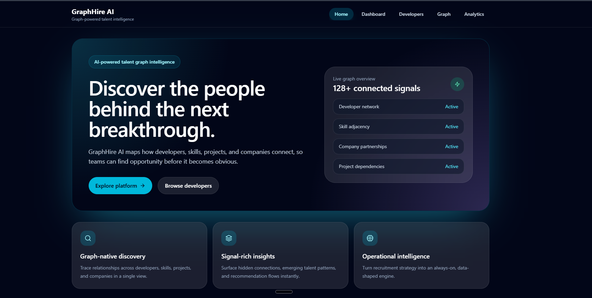
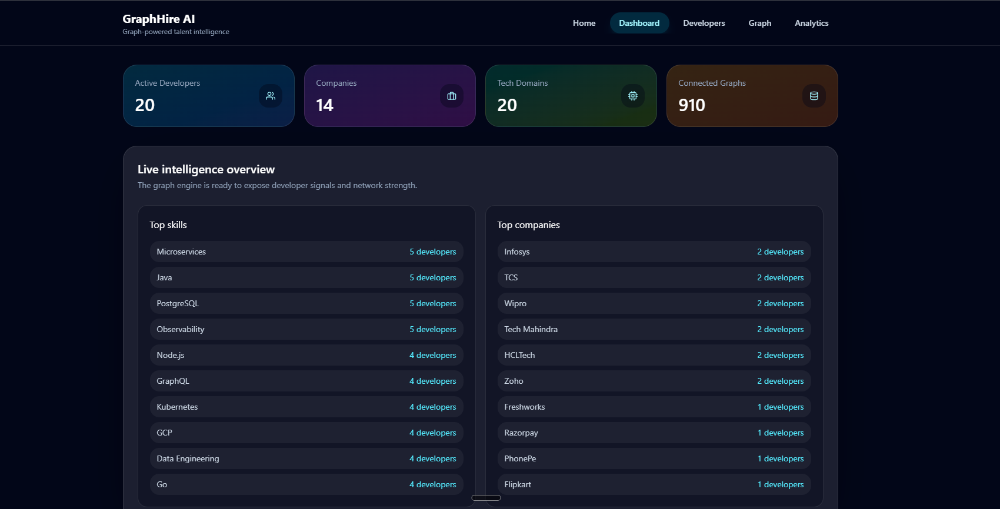
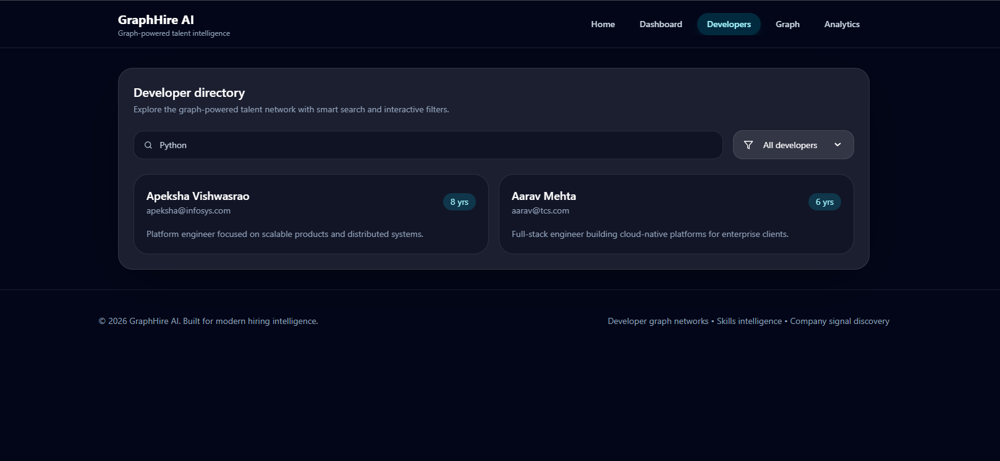
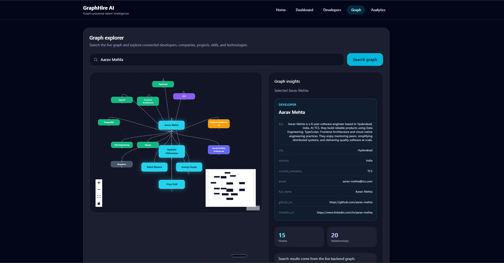
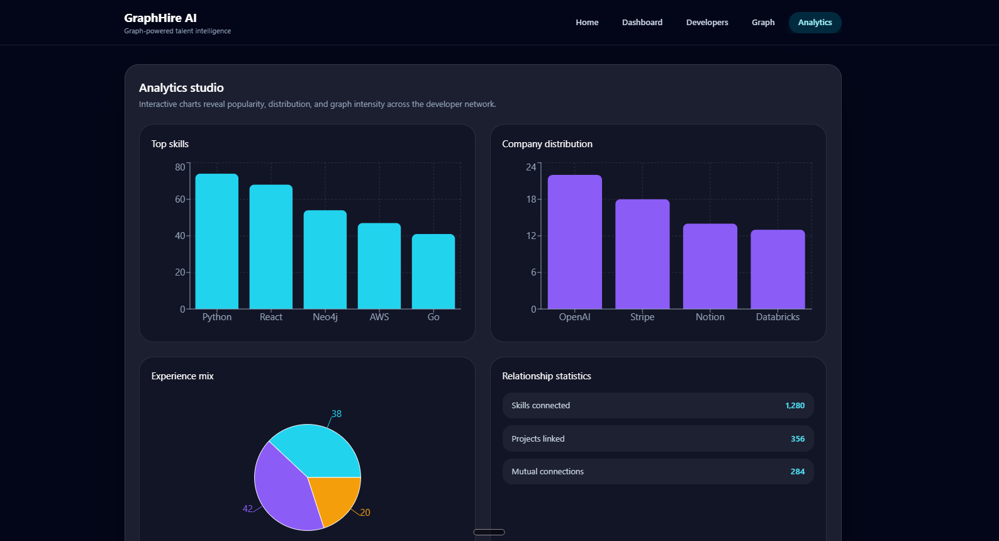

# GraphHire AI

**Graph-powered talent intelligence for discovering developers, skills, companies, technologies, projects, and professional relationships.**

GraphHire AI is a full-stack graph database application built for the **WEXA AI CognoDB Take-Home Assignment**. It uses **CognoDB Cloud** as the graph database layer through the official Neo4j Python driver and provides an interactive web application for exploring developer networks and graph relationships.

### Live Demo

**Frontend:** https://graph-hire-ai-zeta.vercel.app/

**Backend API:** https://graphhire-ai-backend.onrender.com/

### Developed by

**Apeksha Ramesh Vishwasrao**

---

# 1. Project Overview

GraphHire AI addresses a common talent intelligence problem: understanding developers not only by their individual profiles, but also by the **relationships between developers, skills, technologies, companies, projects, certifications, and locations**.

Instead of treating developers as independent records, GraphHire AI models the talent ecosystem as a connected graph.

For example:

```text
Developer
   │
   ├── HAS_SKILL ──> Skill
   │
   ├── WORKED_AT ──> Company
   │
   ├── BUILT ──────> Project
   │
   ├── USES ───────> Technology
   │
   ├── CERTIFIED_IN ──> Certification
   │
   └── LOCATED_IN ──> Location
```

This allows the application to answer relationship-oriented questions such as:

* Which developers have a particular skill?
* Which developers have worked at the same company?
* Which developers share technologies?
* Which developers are connected through multiple relationships?
* Which developers are good candidates for a particular recommendation?
* What technologies and skills are connected to a developer?
* How are developers connected through companies, skills, and technologies?

---

# 2. Why a Graph Database?

A graph database is a natural fit for GraphHire AI because the core information is highly connected.

A traditional relational database could store developers, companies, skills, projects, and technologies in separate tables. However, exploring relationships across several entities would require multiple joins and increasingly complex queries.

With a graph database, relationships are first-class data.

For example:

```text
Developer
   ↓
HAS_SKILL
   ↓
Skill
   ↓
shared with
   ↓
Another Developer
   ↓
WORKED_AT
   ↓
Company
```

This makes graph traversal and relationship-based discovery much more natural.

GraphHire AI benefits from a graph database because it can perform:

* Multi-hop relationship traversal
* Skill-based developer discovery
* Company and career relationship exploration
* Technology relationship analysis
* Developer recommendations
* Network visualization
* Connected talent discovery

The graph structure becomes increasingly valuable as the number of relationships grows.

---

# 3. Technology Stack

## Frontend

* React
* Vite
* React Router
* Tailwind CSS
* Framer Motion
* Recharts
* React Flow
* Axios
* TanStack React Query

## Backend

* Python
* Flask
* Flask Blueprints
* Gunicorn
* Python-dotenv
* Official Neo4j Python Driver

## Database

* CognoDB Cloud
* openCypher
* Bolt protocol
* Neo4j-compatible graph database

## Deployment

* Frontend: Vercel
* Backend: Render

---

# 4. System Architecture

```text
                    ┌───────────────────────┐
                    │       User            │
                    │   Web Browser         │
                    └───────────┬───────────┘
                                │
                                ▼
                    ┌───────────────────────┐
                    │ React + Vite          │
                    │ Frontend              │
                    │                       │
                    │ Dashboard             │
                    │ Developers            │
                    │ Graph Explorer        │
                    │ Analytics             │
                    └───────────┬───────────┘
                                │
                              HTTP
                                │
                                ▼
                    ┌───────────────────────┐
                    │ Flask REST API        │
                    │                       │
                    │ Routes / Controllers  │
                    │ Services              │
                    │ Query Layer           │
                    └───────────┬───────────┘
                                │
                         Neo4j Python Driver
                                │
                                ▼
                    ┌───────────────────────┐
                    │     CognoDB Cloud     │
                    │                       │
                    │   Graph Database      │
                    └───────────────────────┘
```

---

# 5. Project Structure

```text
GraphHire-AI/
│
├── backend/
│   ├── app.py
│   ├── config.py
│   ├── database/
│   │   └── ...
│   ├── controllers/
│   │   └── ...
│   ├── routes/
│   │   └── ...
│   ├── services/
│   │   └── ...
│   ├── queries/
│   │   └── ...
│   ├── requirements.txt
│   └── ...
│
├── src/
│   ├── components/
│   ├── context/
│   ├── layouts/
│   ├── pages/
│   ├── services/
│   ├── App.jsx
│   └── main.jsx
│
├── public/
│   └── ...
├── screenshots/
│   └── ...
├── .env.example
├── .gitignore
├── package.json
├── vite.config.js
└── README.md
```

The backend follows a layered architecture:

```text
Routes
   ↓
Controllers
   ↓
Services
   ↓
Query Layer
   ↓
CognoDB
```

This separation keeps API handling, business logic, and database queries easier to maintain.

---

# 6. Graph Data Model

GraphHire AI uses the following primary node types.

## Nodes

| Node          | Description                                       |
| ------------- | ------------------------------------------------- |
| Developer     | Developer profile and professional information    |
| Skill         | Developer skill                                   |
| Company       | Organization where developers work or have worked |
| Project       | Project associated with developers                |
| Technology    | Technology used by developers or projects         |
| Certification | Professional certification                        |
| Location      | Developer or company location                     |

## Relationships

| Relationship        | Meaning                                 |
| ------------------- | --------------------------------------- |
| `HAS_SKILL`         | Developer has a skill                   |
| `WORKED_AT`         | Developer worked at a company           |
| `BUILT`             | Developer built a project               |
| `USES`              | Developer or project uses a technology  |
| `LEARNED`           | Developer learned a technology or skill |
| `INTERESTED_IN`     | Developer is interested in an area      |
| `CERTIFIED_IN`      | Developer has a certification           |
| `LOCATED_IN`        | Developer is located in a location      |
| `COLLABORATED_WITH` | Developers collaborated                 |
| `MENTORS`           | One developer mentors another           |

## Graph Relationship Example

```text
                                 ┌──────────────┐
                                 │   Company    │
                                 └──────▲───────┘
                                       │
                                    WORKED_AT
                                       │
                                       │
         ┌──────────────┐          ┌─────┴──────┐
         │    Skill     │◄─HAS_SKILL─│ Developer │
         └──────────────┘          └─────┬──────┘
                                       │
                                       BUILT
                                       │
                                 ┌──────▼──────┐
                                 │   Project   │
                                 └──────┬──────┘
                                       │
                                       USES
                                       │
                                 ┌──────▼──────┐
                                 │ Technology  │
                                 └─────────────┘
```

This structure allows the application to traverse multiple relationships instead of simply retrieving isolated records.

---

# 7. Multi-Hop Graph Traversal

One of the important requirements of this assignment is demonstrating graph queries that traverse multiple relationships.

GraphHire AI supports multi-hop traversal such as:

```text
Developer
   ↓
HAS_SKILL
   ↓
Skill
   ↓
shared by
   ↓
Another Developer
```

Another example:

```text
Developer
   ↓
WORKED_AT
   ↓
Company
   ↓
WORKED_AT
   ↓
Other Developer
```

These types of relationship queries are useful for discovering connected talent and recommending developers based on shared professional signals.

---

# 8. Queries and Parameterization

GraphHire AI uses the official Neo4j Python driver to communicate with CognoDB.

Database credentials are loaded through environment variables rather than being hard-coded.

Queries use parameters rather than string concatenation.

Conceptually:

```cypher
MATCH (d:Developer)
WHERE d.name CONTAINS $query
RETURN d
LIMIT $limit
```

Parameters are supplied separately by the backend.

This approach helps avoid unsafe query construction and keeps the database layer maintainable.

---

# 9. Main Application Features

## Home

The home page introduces GraphHire AI and provides access to the main talent intelligence features.

## Dashboard

The dashboard provides a high-level overview of the graph including developer, company, technology, and relationship signals.

## Developer Directory

Users can search and explore developers by name or email.

Example information includes:

* Developer name
* Email
* Experience
* Professional description
* Available graph-related information

The directory also provides filtering for senior developers.

## Graph Explorer

The Graph section provides an interactive visualization of relationships returned from the live graph database.

Users can search for a:

* Developer
* Company
* Skill
* Technology
* Project
* Certification
* Location

The graph visualization is designed to remain readable even when a search result has many relationships.

For developer-focused searches:

```text
                    Company
                       │
                       │ WORKED_AT
                       │
Skill ── HAS_SKILL ── Developer ── BUILT ── Project
                       │
                       │ USES
                       │
                  Technology
```

The searched developer is positioned as the central node, while related entities are arranged around it according to their graph type.

The Graph Explorer also:

* Limits the number of displayed nodes for readability.
* Limits displayed relationships to prevent an overcrowded graph.
* Uses different visual styles for different node types.
* Provides zoom and pan controls through React Flow.
* Provides a minimap for navigating the graph.
* Displays the actual relationship type on graph edges.
* Provides a loading state while graph data is being retrieved.
* Provides an empty state when no matching graph data is found.
* Allows users to click individual nodes for inspection.

This approach keeps the graph useful for human exploration instead of displaying an unnecessarily large and difficult-to-read network.

## Analytics

The analytics section presents graph-related information through visual summaries and charts.

## Recommendations

The application provides developer recommendation functionality based on graph relationships and shared signals.

## Search

The search functionality allows the frontend to query developers and graph entities based on user input.


## Graph Explorer

The Graph section provides an interactive representation of graph relationships.

Users can explore connections between developers and other entities such as:

* Skills
* Companies
* Technologies
* Projects
* Certifications
* Locations

## Analytics

The analytics section presents graph-related information through visual summaries and charts.

## Recommendations

The application provides developer recommendation functionality based on graph relationships and shared signals.

## Search

The search API allows the frontend to query developers and graph entities based on user input.

---

# 10. API Endpoints

The Flask backend exposes REST endpoints for the frontend.

| Method | Endpoint                 | Purpose                    |
| ------ | ------------------------ | -------------------------- |
| GET    | `/developers`            | Retrieve/search developers |
| GET    | `/developer/<...>`       | Retrieve a developer       |
| GET    | `/companies`             | Retrieve companies         |
| GET    | `/company/<...>`         | Retrieve a company         |
| GET    | `/projects`              | Retrieve projects          |
| GET    | `/project/<...>`         | Retrieve a project         |
| GET    | `/skills`                | Retrieve skills            |
| GET    | `/skill/<...>`           | Retrieve a skill           |
| GET    | `/recommendations/<...>` | Developer recommendations  |
| GET    | `/search`                | Graph search               |
| GET    | `/graph`                 | Graph/network data         |
| GET    | `/dashboard`             | Dashboard statistics       |

> Endpoint parameters may vary slightly depending on the route implementation.

---

# 11. Backend Error Handling

The Flask application includes error handling so that API failures can be returned as structured responses instead of causing the application to crash unexpectedly.

The application also handles database-related failures gracefully and provides an appropriate error state to the frontend.

For example, if the database is unavailable, the frontend can display an API/database error message instead of rendering broken data.

---

# 12. Environment Variables

Sensitive connection details are loaded from environment variables.

Example:

```env
COGNODB_URI=bolt+s://your-instance.databases.cognodb.cloud
COGNODB_USERNAME=cognodb
COGNODB_PASSWORD=your-password
SECRET_KEY=your-secret-key
PORT=5000
```

### Important

The actual `.env` file should **never be committed to GitHub**.

Only `.env.example` should be included in the repository.

For example:

```env
COGNODB_URI=
COGNODB_USERNAME=
COGNODB_PASSWORD=
SECRET_KEY=
PORT=
```

The real values should be configured locally and in the deployment platforms' environment-variable settings.

---

# 13. CognoDB Setup

GraphHire AI uses CognoDB Cloud as its graph database.

## Step 1 — Create a CognoDB account

Create an account through the CognoDB Cloud console.

## Step 2 — Create a database instance

Create a free CognoDB instance and select the desired region.

## Step 3 — Save the connection details

CognoDB provides:

* Bolt connection URI
* Username
* Password

The password should be saved securely because it is provided when the database credentials are created.

## Step 4 — Configure environment variables

Add the credentials to your local `.env` file:

```env
COGNODB_URI=bolt+s://...
COGNODB_USERNAME=cognodb
COGNODB_PASSWORD=...
```

## Step 5 — Start the application

The Flask backend connects to CognoDB through the official Neo4j Python driver.

---

# 14. Local Installation

## Prerequisites

Make sure the following are installed:

* Python 3
* Node.js
* npm
* Git
* A CognoDB Cloud instance

---

## Clone the repository

```bash
git clone https://github.com/apekshavishwasrao2112/GraphHire-AI.git
cd GraphHire-AI
```

---

# 15. Backend Setup

Create and activate a Python virtual environment.

### Windows

```powershell
python -m venv .venv
.venv\Scripts\Activate.ps1
```

Install dependencies:

```powershell
pip install -r backend/requirements.txt
```

Create the environment file:

```powershell
copy .env.example .env
```

Add your CognoDB credentials to `.env`.

Start the backend:

```powershell
python -m backend.app
```

The backend will run locally on the configured port.

---

# 16. Frontend Setup

Install JavaScript dependencies:

```bash
npm install
```

Start the Vite development server:

```bash
npm run dev
```

The frontend will provide a local development URL.

The production frontend is built with:

```bash
npm run build
```

The development command is used for local development, while the build command generates the optimized production assets used by deployment platforms such as Vercel.

---

# 17. Frontend → Backend Communication

The frontend communicates with the deployed Flask API using Axios.

The API base URL is configured separately from the React application so that local development and production deployments can use different backend URLs.

Production architecture:

```text
Vercel
React Frontend
      │
      │ HTTPS API requests
      ▼
Render
Flask Backend
      │
      │ Bolt
      ▼
CognoDB Cloud
```

---

# 18. Deployment

## Frontend — Vercel

The React/Vite frontend is deployed on Vercel.

Production URL:

https://graph-hire-ai-zeta.vercel.app/

The frontend is built using:

```bash
npm run build
```

## Backend — Render

The Flask backend is deployed on Render.

Production URL:

https://graphhire-ai-backend.onrender.com/

The backend uses Gunicorn in production:

```bash
gunicorn backend.app:app
```

The backend's environment variables are configured through Render rather than committed to the repository.

---

# 19. Security

The project follows the following security practices:

* Database credentials are loaded from environment variables.
* Passwords are not hard-coded in application source code.
* `.env` files are excluded from Git.
* `.env.example` contains only placeholder values.
* Cypher queries use parameters.
* Production secrets are configured through hosting-platform environment variables.

---
# 20. UI / UX

GraphHire AI was designed as a modern SaaS-style application rather than a basic CRUD interface.

The interface includes:

* Responsive navigation
* Dashboard cards
* Developer search
* Developer directory
* Developer filtering
* Interactive graph visualization
* Center-focused graph layout
* Node-type visual differentiation
* Graph zoom and pan controls
* Graph minimap
* Loading states
* Empty states
* Error states
* Responsive layouts
* Dark/light theme support
* Interactive transitions and animations

The Graph Explorer intentionally limits the visible graph to keep large relationship networks readable.

Instead of displaying every connected relationship at once, the visualization focuses on the most relevant returned nodes and relationships and arranges them around the searched entity.

This makes the graph easier to understand and demonstrates the underlying graph relationships without overwhelming the user with hundreds of nodes and edges.

---

# 21. Screenshots


### Home



### Dashboard



### Developer Directory



### Graph Explorer



### Analytics



---

```text
screenshots/
```
```text
GraphHire-AI/
│
├── backend/
├── src/
├── public/
├── screenshots/
│   ├── analytics.png
│   ├── dashboard.png
│   ├── developers.png
│   ├── graph.png
│   └── home.png
│
└── README.md
```

### 1. Home page

Show:

* GraphHire AI branding
* Navigation
* Main hero section
* Main application features

### 2. Dashboard

Show:

* Developer statistics
* Company statistics
* Technology statistics
* Graph/network information


### 3. Developer Directory

Show:

* Search box
* Developer cards
* Developer information
* Skills/technologies

### 4. Graph Explorer

Show the actual graph visualization with connected nodes and relationships.

### 5. Analytics

Show:

* Charts
* Graph statistics
* Talent/network insights

---

# 22. Seed / Realistic Data

GraphHire AI uses realistic developer, company, skill, technology, project, certification, and location data to demonstrate the graph model.

The seed/data-loading logic is included in the repository so that the graph can be reproduced and populated during setup.

The dataset is intentionally sized appropriately for a development/free-tier graph database while still providing enough relationships to demonstrate graph traversal and recommendations.

---


# 23. Graceful Database Failure

The application does not assume that the graph database will always be available.

If CognoDB becomes unavailable, the backend handles the database exception and returns an appropriate API response.

The frontend can then display an understandable error state rather than leaving the user with an unexplained blank page.

This provides a better user experience and separates infrastructure failures from frontend rendering.

---

# 24. Engineering Decisions

The project separates responsibilities into different layers.

```text
Frontend
   │
   ▼
REST API Routes
   │
   ▼
Controllers
   │
   ▼
Services
   │
   ▼
Cypher Query Layer
   │
   ▼
Database
```

This structure makes the project easier to understand, test, debug, and extend.

The frontend is also separated into pages, reusable components, layouts, contexts, and API services.

---

# 25. Future Improvements

Potential future improvements include:

* Authentication and authorization
* Role-based access control
* More advanced recommendation scoring
* Graph clustering
* Advanced graph filtering
* Candidate-to-job matching
* Admin graph management
* Real-time graph updates
* More sophisticated talent ranking
* Additional analytics
* Automated seed-data ingestion
* Improved graph visualization controls

---

# 26. Submission

### GitHub Repository

https://github.com/apekshavishwasrao2112/GraphHire-AI

### Hosted Application

https://graph-hire-ai-zeta.vercel.app/

### Backend API

https://graphhire-ai-backend.onrender.com/

The repository contains the complete source code, frontend, backend, database integration, graph queries, configuration examples, and documentation required to run the application.

---

# 27. Author

**Apeksha Ramesh Vishwasrao**

GraphHire AI — Graph-powered talent intelligence

Built as part of the **WEXA AI CognoDB Take-Home Assignment**.
